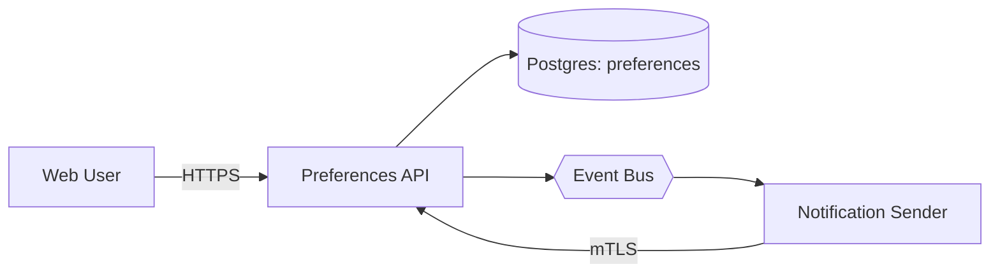

# RFC Dataflow Diagram

Turns the architecture/API/data-model sections of an RFC (or any system design doc) into a clear dataflow diagram: who initiates a request, which service/API handles it, what database or downstream service it touches, and what data moves in each direction.

## Step 1: Extract the flow model

Read the RFC (from the conversation, an uploaded file, or an artifact) and pull out, in this order of priority:
1. **Actors / clients** — who initiates action (web user, mobile client, other internal services, cron jobs).
2. **APIs / endpoints** — group by the service that owns them (e.g. "Preferences API": GET, PATCH, POST /reset).
3. **Datastores** — databases, caches, queues, event buses, and which service reads/writes them.
4. **Downstream/internal consumers** — other services that call this feature's API or subscribe to its events.
5. **Direction of data** — for each edge, note request vs. response, and briefly what data/payload moves (not full schemas — just the gist, e.g. "user_id, category, channel").
6. **Sensitive data per edge** — for each edge, check whether the payload includes anything *security-sensitive*: authentication credentials (passwords, tokens, session cookies, API keys, secrets), PII (name, email, phone, physical address, government ID numbers), financial data (card/account numbers), or health data. If the RFC's payload examples, auth section, or security-considerations section name such a field, flag that edge (see Step 3). Internal identifiers that aren't security-sensitive on their own — `user_id`, `category_id`, other primary/foreign keys, timestamps, enum values like a channel or category name — do NOT count as sensitive and should never be flagged, even though they technically reference a user; the bar is "would leaking this directly enable fraud, account takeover, identity theft, or a privacy violation," not "is this field about a person." If the RFC is silent on payload contents for an edge, don't guess — leave it unflagged rather than inventing a sensitive field that isn't documented.
7. **Authentication per edge** — check the RFC's security/auth section and each API definition for how the caller is authenticated on that specific edge (session cookie, bearer token, mTLS, service-mesh auth, API key, IAM role, none/unauthenticated, etc.). Only label an edge with an auth mechanism the RFC actually states for that edge — never infer or default one (e.g. don't assume "the API must auth to its database somehow" and invent "IAM role" if the RFC never says so). If the RFC is silent on how a given edge authenticates, leave that edge's auth label off entirely rather than guessing.

If any of these are ambiguous or missing from the doc, make a reasonable inference from context (e.g. a PATCH endpoint implies a write path to the primary datastore) rather than stopping to ask — note the assumption briefly in your reply, don't block on it.

Do not try to diagram every field or every error path. A dataflow diagram should show the *shape* of the system: nodes = actors/services/stores, edges = data in motion. Leave validation rules, error codes, and full schemas out — those belong in the RFC text, not the diagram.

## Step 1a: Classify every node into its architectural layer

Enterprise applications are conventionally layered, and a legible DFD should make that layering visible rather than arranging nodes by graph topology alone. Classify each node from Step 1 into one of these layers, in this left-to-right order:

1. **Client layer** — web browser, mobile app, thin client, or any other end-user-facing actor.
2. **Web layer** — the request-handling tier in front of the actual business logic: a load balancer, API gateway, BFF (backend-for-frontend), or web server. Only give this its own layer if the RFC actually describes a distinct component here; many RFCs (especially for a single internal service) have the client talk directly to the service layer with no separate web tier, in which case skip this layer entirely rather than inventing a placeholder node for it.
3. **Service layer** — the API/business-logic service(s) the RFC is actually specifying, *plus* any peer internal services it communicates with, in either direction (a service it calls, or a service that calls it). These peers sit at the same architectural tier as the service being specified — a service-to-service call is a same-layer relationship, not a downstream one — so they share the service layer's column even though they're out of scope for this RFC (they still get the "out of scope" color from Step 3's two-color convention; layer and in-scope/out-of-scope are two independent signals, not the same thing). Only classify a node as client layer instead of service layer if it's genuinely an end-user-facing actor, not another backend service.
4. **Data layer** — everything that handles data rather than business logic: databases, file storage, object storage (e.g. S3), and also event buses, message queues, and caches. An event bus or queue isn't a service — it doesn't implement business logic, it moves or holds data on behalf of services — so it belongs in the same layer/column as the databases, not in its own separate tier and not grouped with the service-layer peers in #3. This layer covers everything the service layer reads, writes, publishes to, or subscribes through.
5. **Third-party services layer** — external, out-of-scope services (payment processors, external APIs, SaaS integrations). Always out of scope for the two-color convention (Step 3), but still gets its own layer/column when the RFC's dataflow includes one, rather than being merged into the service layer's internal peers — third-party services are a different trust boundary from internal peer services even though both sit "outside" the RFC's subject service.

Only create a layer/column for a layer that actually has at least one node in this RFC — never add an empty or placeholder column for a layer the system doesn't have. When a system has multiple layers that could plausibly branch off the service layer in parallel (data storage, other internal services, third-party services), each still gets its own distinct column — don't collapse them into one shared column just because they're all "downstream of the service layer." See Step 2a for how this layer classification becomes the actual column assignment.

## Step 2: Choose the output format

Ask yourself where this diagram needs to live:

- **Inline in the chat, for the user to look at right now** → use the Visualizer (`visualize:read_me` with the `diagram` module, then `visualize:show_widget`). This is the default for a standalone "generate a dataflow diagram" request.
- **Embedded inside a Markdown/docx RFC artifact so it stays in the document** → use a Mermaid `flowchart` or `sequenceDiagram` block inside the markdown file. Mermaid renders natively in `.md` artifacts, and its default layout engine (dagre) already performs proper layered graph drawing — see Step 2a, second bullet.
  - Use `flowchart LR` (left-to-right) for a system/architecture-style dataflow diagram (actors → API → DB/services).
  - Use `sequenceDiagram` instead if the request is really about *ordering* of calls over time (e.g. "show the request/response sequence for PATCH") rather than the static shape of the system.
- If unsure which the user wants, default to inline Visualizer — it's zero-commitment and easy to regenerate — and mention that you can also drop a Mermaid version into the RFC doc on request.

Never use both for the same request unless asked; pick one per Step 2's decision.

## Step 2a: Layout — one column per architectural layer, laid out with layered (Sugiyama-style) graph drawing

Regardless of output format, the node layout should follow the layer classification from Step 1a as its primary column assignment, then use a layered graph drawing algorithm to arrange nodes within and across those columns — not eyeballed coordinates, and not a pure graph-topology rank that ignores the architectural layering. This isn't optional polish — it's what keeps a diagram with more than a handful of nodes/edges legible, keeps edges from cutting through unrelated boxes, and keeps the diagram reading like the layered enterprise architecture it actually is.

**For the Visualizer/SVG output**, compute the layout explicitly before writing any SVG:
1. **Column assignment follows Step 1a's layers first**: every node in the same layer shares the same column (the same x-position/rank), in the order client → web → service (including same-tier peer services, in either call direction) → {data (including event buses/queues/caches), third-party}. This takes priority over a pure graph-topology rank — e.g. a peer service that calls *into* the RFC's subject service still shares its column rather than being placed as if it were upstream of it, and an event bus shares the data layer's column rather than getting its own, since it handles data rather than business logic. Nodes in the same layer stay aligned even if their graph-distance from a source node technically differs.
2. **Break cycles first**: real system diagrams often have cycles (a service that both calls out to, and is called back by, another node — e.g. a "trigger" edge one way and a synchronous "check"/callback edge the other way). Before finalizing layout, pick a minimal set of edges to treat as feedback edges and exclude them from column assignment — the natural choice is almost always the response/callback-style edge (the one that reads as "X asks Y", drawn as Y calling back into X), not the initiating request edge. If the two directions connect the *same pair of nodes*, route them together as a double line (see the "two-way traffic" bullet in Step 3) rather than sending one around the top and the other around the bottom of the diagram — a shared route reads as "these two talk both ways," while two separately routed paths read as two unrelated long edges that happen to exist. Only split them onto genuinely separate routes if they don't share both endpoints.
3. **Lay out columns in one consistent direction** (left-to-right or top-to-bottom — match whichever reads more naturally for the specific system; left-to-right for a request/response chain, top-to-bottom for a layered stack). Give every inter-column gap the same spacing; don't compress some gaps and stretch others to save space.
4. **Order nodes within a column to minimize edge crossings — but align in-scope components first**: before applying the general barycenter heuristic, check whether two or more "in scope" nodes (the purple ones from Step 3's two-color convention — the components this RFC actually specifies) sit in different columns. If so, give them the same row whenever the rest of the layout allows it, even ahead of minimizing crossings for out-of-scope nodes — the components this RFC is actually about should read as visually grouped, since that's the part of the diagram most worth a reviewer's attention. Only after in-scope alignment is settled, place the remaining (out-of-scope) nodes using the ordinary barycenter heuristic: close to the vertical/horizontal position of the neighbor(s) they connect to in the adjacent column. None of this needs to be exact — just deliberate rather than arbitrary, with in-scope alignment taking priority when the two goals conflict.
5. **Route edges from consistent anchor points**: for a hub node with several edges (e.g. a central service), spread the connection points around its perimeter (distinct points on the left edge, right edge, top, bottom) rather than bunching every edge into the same corner — this is what actually prevents edges from visually crossing each other near a busy node.
6. Only after ranks, order, and anchor points are decided should you compute actual pixel coordinates and write the SVG — don't place boxes by guesswork and then try to route edges around whatever gaps happen to exist.
7. **Prefer a single straight-line connection over any multi-segment bent path — a straight line can be diagonal**: a "straight line" means zero bends, not "horizontal or vertical." Between an edge's exit point and its target's entry point, use one direct line segment at whatever angle connects them, as long as that direct line doesn't pass through another node's box or overlap another edge's path. Only introduce a bend (going to an L-shaped, Z-shaped, or corridor-routed path) when the direct straight line would actually cross something — a bend exists to route *around* an obstacle, not as a stylistic default. This means: two nodes that already share a row or column get a straight horizontal/vertical line (the simplest case, and often collision-free by construction — see the barycenter ordering in step 4, which exists partly to create more of these); two nodes that don't share a row or column still get a single straight diagonal line whenever that direct path is clear, rather than being routed through an artificial corridor. When several edges need to route around the same obstacle in the same gap between columns, order them so the edge with the shallowest target sits closest to the target column and the edge with the deepest target sits furthest out — this prevents a shallow edge's short final jog into its target from cutting across a deeper edge's still-descending run. Sanity-check each straight line and each bent path's segments against every node and every other edge's path before finalizing coordinates, the same way you already check node crossings.

**For Mermaid output**, this is already handled: Mermaid's default renderer (dagre) performs Sugiyama-style layered graph drawing automatically from the edge list you give it. Don't try to manually control node positions in Mermaid — just declare the nodes and edges in a sensible order and let the layout engine do the ranking, ordering, and routing. The one thing worth doing manually in Mermaid is still picking `LR` vs `TD` direction (per Step 2) and, if a real feedback/cycle edge exists, being aware that dagre will route it back visually — that's expected and correct, not a bug to fix.

## Step 3: Diagram conventions

Keep it consistent regardless of which renderer you use:

- **Actors/clients**: rounded rectangle or stick-figure style, e.g. "Web User", "Mobile Client", "Cron Job".
- **Services/APIs**: rectangle, labeled with the service name; list its 1–3 key endpoints inside or as an edge label, not both (avoid clutter).
- **Datastores**: cylinder shape (or Mermaid `[(Database)]`), labeled with the engine/table group if known (e.g. "Postgres: preferences").
- **Caches/queues/event buses**: hexagon or distinct fill color, clearly distinguished from primary datastores.
- **Uniform node size**: every node in the diagram — actor, service, datastore, event bus, regardless of shape — gets the same fixed width and height (a size that comfortably fits the longest label you need to show, e.g. 190×64 for the Visualizer/SVG output). Don't grow or shrink a box to match its label's length or its perceived importance; a hub node with six edges is the same size as a leaf node with one. If a label doesn't fit at that fixed size, shorten the label (abbreviate, drop a subtitle word) or wrap it onto a second line within the same fixed height — never widen the box to accommodate it. This keeps the layered layout's spacing and edge routing predictable, and keeps visual weight from implying importance that isn't there.
- **Two colors only**: don't assign a different color per node type (actor vs. service vs. datastore vs. queue). Use exactly two fill colors, based on a single distinction — whether the RFC is actually specifying that component, or whether it's an external actor/dependency/downstream consumer the RFC only *interacts with*. "In scope" is whatever the RFC's proposed design section (§3-style) is defining: the service being built and the datastore(s) it owns. "Out of scope / downstream" is everything else that shows up in the dataflow but isn't what this RFC specifies — client actors, other pre-existing internal services, shared infrastructure like an event bus, and downstream consumers. When it's ambiguous whether a component counts as in-scope (e.g. a datastore the RFC merely reuses rather than newly defines), default to out-of-scope rather than guessing it's part of what's being proposed. Node shape (box/cylinder/hexagon) still distinguishes actor vs. service vs. datastore vs. queue — color no longer does; shape and color are now two independent signals, not redundant ones.
- **Edges**: arrow in the direction data flows. Label with a protocol or mechanism name **only when the RFC states it directly, verbatim, for that specific edge** — never guess or derive one, even as a fallback. This means: no multi-layer stacks, no splitting out an HTTP version (HTTP/1.1, HTTP/2, HTTP/3, gRPC's H2) as if it were a separate protocol, and no translating one stated term into a different one you infer from it — e.g. if the RFC states an edge's auth mechanism as "mTLS," label it `mTLS`; do not further translate that into `HTTPS` on the theory that mTLS implies TLS-secured HTTP underneath. That translation is a derivation, and derivations are exactly what this rule excludes, regardless of how reasonable the inference seems. REST and gRPC are excluded from labels even when the RFC names them, because they're not protocols (REST is a style built on HTTP, gRPC is a framework built on HTTP) — but do not compensate by writing in the real protocol underneath (`HTTP`) unless the RFC states that term directly too; if it only says "gRPC" or "REST" with nothing else, that edge gets no label at all rather than a derived `HTTP`. If the RFC is silent on any protocol or mechanism for a given edge (common for API-to-database or API-to-event-bus edges), leave that edge unlabeled — an unlabeled edge honestly reflects "the RFC doesn't say." All edges are solid lines — don't distinguish synchronous from asynchronous/event-driven edges by line style either; that distinction isn't shown on this diagram.
- **Two-way traffic between the same node pair**: when two nodes have edges running in both directions (e.g. a service sends a triggering call one way and receives a separate synchronous callback the other way), draw them as a **double line** — two closely parallel lines following the same route, each with its own arrowhead pointing in its own direction — rather than routing them completely separately (e.g. one above the whole diagram, one below). Offset the parallel lines by a small, consistent gap (a few px) along their whole shared path, and offset their start/end anchor points on each node slightly so the two lines don't overlap exactly at the boxes either. This reads as "these two nodes talk to each other in both directions" at a glance, which two unrelated-looking routed paths don't convey. Only bundle edges this way when they connect the *same two nodes*; don't bundle edges that merely happen to cross paths.
- The diagram shows protocol only, nothing else on the edge — no authentication mechanism, no sensitive-data flag, no security control, no legend explaining colored segments (there are none). Step 1's authentication/sensitive-data extraction still happens (Step 6's table is the place for it), but none of it renders on the graph. If a prior version of this diagram included auth/sensitive-data/security-control labels, drop them on the next render even without being asked again.
- **Grouping**: if the RFC has clearly separated "public API" vs "internal API" surfaces, visually group or color them differently so the trust boundary is legible at a glance.
- **Label placement**: every edge label must sit adjacent to that edge's own line — beside a straight segment or in a gap the line actually passes through — not floating near a node with no visual connection to the line it describes (e.g. don't park a label just below a box when the edge it labels is routed somewhere else entirely). If a label can't fit next to the relevant segment without hitting another line or a box, find a clear spot along a *different* segment of that same edge's path rather than moving it off the path altogether.

Keep the diagram to one screen/page. If the system has more than ~8–10 nodes, split into a high-level diagram plus one or two focused sub-diagrams (e.g. "write path" and "read path") rather than cramming everything into one dense graph.

## Step 4: Generate

**For Visualizer output:**
1. Call `visualize:read_me` with `modules: ["diagram"]` (silently — don't narrate this call).
2. Build the SVG following the conventions above and the module's layout/CSS guidance.
3. Call `visualize:show_widget` with a specific, disambiguating title (e.g. `notification_prefs_dataflow`, not `diagram`).

**For Mermaid-in-markdown output:**
1. If editing an existing RFC artifact/file, insert the Mermaid block in a logical location (typically right after the "High-level architecture" or "Proposed Design" section, replacing any ASCII-art diagram that served the same purpose).
2. Use clear node IDs and a legend/comment if abbreviations are used.
3. Re-save/re-present the file per the standard file-creation workflow.

Example Mermaid skeleton for the flowchart style:

## Step 5: Explain briefly, don't over-narrate

After producing the diagram, give at most 2-3 sentences pointing out anything non-obvious (e.g. an async edge, a trust boundary, a cache layer) — the diagram should carry most of the weight. Don't re-describe every node/edge in prose; that duplicates the diagram.

## Step 6: Security-controls table (when asked for a table instead of, or alongside, the diagram)

Some requests want the same per-edge analysis as a table rather than a graph — or both. Reuse the exact same extraction from Step 1 (endpoint pairs, sensitive data, stated auth mechanism) rather than re-deriving it.

**Default columns**, in this order, unless the user specifies a different set: **Endpoint pair, Sensitive data, Authentication method, Authorization, Input validation, Data protection (storage), Data protection (in-transit), Logging.** Rate limiting and DoS/resource-exhaustion controls are out of scope for this table by default — they belong in prose or a separate table, not mixed into this one — unless the user explicitly asks to include them.

If the user has previously specified a different column set or order in this conversation, treat that as the standing convention for this RFC and reuse it on the next table request rather than reverting to the default above.

Row granularity: one row per endpoint pair (edge), same as a diagram edge — e.g. "Web user → Profile Service", "Profile Service → Postgres DB". If a single edge has controls spanning several categories (e.g. both an authentication control and a separate authorization control), put them in their respective columns of the *same* row rather than splitting into multiple rows — this table is wider, not taller, unlike the earlier category-grouped format.

Cell content rules:
- Only state a control the RFC actually specifies for that edge, in that category. Never infer or invent one (e.g. don't assume "the API must validate input somehow" and write a generic claim if the RFC doesn't say so for that edge).
- If the RFC specifies nothing for a given cell, write **"—"** (or "not specified by the RFC" if the table is small enough that spelling it out reads better) rather than leaving it silently blank or guessing — an empty-looking cell reads as "forgot to check" whereas an explicit marker reads as "checked, and there's a real gap." Call out any such gaps briefly after the table if there are more than one or two, since a table full of the RFC's real gaps is itself a useful finding.
- Sensitive-data cells follow the same narrow definition as Step 1.6 (credentials/secrets, PII, financial, health data — never plain identifiers). When the RFC doesn't state that an edge carries anything sensitive, write exactly **"Not mentioned"** in that cell — not "None", "None stated", "—", or a longer explanatory sentence. This is a deliberate departure from the general empty-cell rule above, specific to this column: "Not mentioned" makes clear this is about what the RFC says (or doesn't), not a claim that the edge is definitely free of sensitive data.
- "Data protection (storage)" only applies to edges that terminate at or originate from a datastore; edges between two non-storage nodes (e.g. service → service, service → event bus) get "N/A" here, not a fabricated storage claim.
- **Authentication method** cells name the specific credential/mechanism *type* the RFC states — "session cookie," "bearer token," "API key," "password," "mTLS" (certificate-based), "service-mesh identity," "OAuth token," "IAM role," etc. — not a paraphrase of the requirement ("authenticated identity required," "restricted to authenticated channels"). If the RFC names more than one acceptable mechanism for an edge (e.g. "mTLS or service-mesh identity"), list each named mechanism; drop a trailing hedge like "or an equivalent" since it names nothing specific to list. If the RFC requires authentication on an edge but never names which specific mechanism satisfies it, that's still a gap under the general empty-cell rule above ("Not specified by the RFC") — don't paper over the missing specificity with a vaguer sentence that sounds like an answer.
- **Authorization** cells lead with the *access-control pattern* the RFC's stated rule implements, then the specific rule itself — e.g. "Ownership-based (self-scoped): acting user must own the resource being modified" rather than just restating the rule in prose with no named pattern. Use the standard pattern name that actually matches what's described, drawn from: ownership-based / self-scoped access, least-privilege service scoping, scope-based authorization (a caller restricted to one specific action or topic), attribute-based access control (a decision gated on a resource attribute or flag, e.g. a fail-closed boolean), role-based access control, or an access-control list. This is naming the *category* of a rule the RFC already states, not inventing a new rule — don't apply a pattern name to a cell that would otherwise be "Not specified by the RFC," and don't force-fit a pattern that doesn't actually match (if the RFC's rule doesn't cleanly match any of these, describe it plainly instead of mislabeling it).
- **Data protection (in-transit)** cells name the specific encrypted protocol when the RFC states one for that edge — "TLS," not "transport-encrypted." A named mechanism on the *same edge* that is definitionally a form of the protocol (e.g. "mTLS" — mutual TLS — named as the authentication method) counts as stating it; write "TLS (via mTLS)" rather than treating it as a separate inference, since mTLS's definition already is TLS, not a leap to an unstated one. When the RFC only says an edge "MUST be transport-encrypted" or similar without naming a protocol anywhere on that edge, encryption is required but unspecified — write "Encrypted; protocol not named" followed by the RFC's exact phrase in quotes, e.g. `Encrypted; protocol not named ("MUST be transport-encrypted")`, rather than either inventing "TLS" or collapsing this down to "Not specified by the RFC" (which would wrongly suggest encryption itself isn't required). Quoting the exact phrase lets a reader verify the gap themselves without a follow-up question, and keeps the table from smoothing over small wording differences between edges (e.g. "MUST be transport-encrypted" vs. a cross-reference like "same internal-traffic-encrypted rule as other service-to-service edges") into a single flattened claim.
- This same verbatim-quote treatment applies to any other cell that states a requirement exists without naming the specific thing that satisfies it — e.g. an edge that requires authentication but never names a mechanism, or a stated access rule that doesn't cleanly match a named access-control pattern. Append the RFC's exact short phrase in quotes rather than only writing "Not specified by the RFC," which reads as if nothing at all was said. Reserve a bare "Not specified by the RFC" (no quote) for cells where the RFC is genuinely silent on that edge in that dimension — nothing to quote because nothing was said.
- Keep each cell to one or two sentences; this is a reference table, not a copy of §5's prose. Point to the RFC section number in parentheses where it helps the reader verify the claim (e.g. "(§5.9)"), especially for anything non-obvious.

If both a diagram and a table are requested in the same turn, produce the diagram first (Steps 2-5), then the table — don't duplicate the sensitive-data/auth findings as prose between them since both artifacts already show it.
