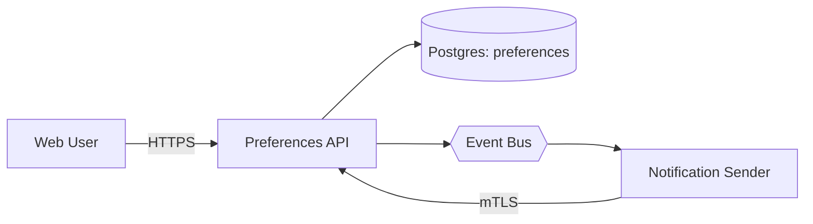

# RFC Dataflow Diagram

Turns the architecture/API/data-model sections of an RFC (or any system design doc) into a clear dataflow diagram: who initiates a request, which service/API handles it, what database or downstream service it touches, and what data moves in each direction.

## Step 1: Extract the flow model

Read the RFC (from the conversation, an uploaded file, or an artifact) and pull out, in this order of priority: The source can also be a codebase rather than an RFC; wherever this skill says "the RFC states" for a code source, read it as what the code configures, calls, or implements, and apply the code branch of the scope rule in Step 3.
1. **Actors / clients** — who initiates action (web user, mobile client, other internal services, cron jobs).
2. **APIs / endpoints** — group by the service that owns them (e.g. "Preferences API": GET, PATCH, POST /reset).
3. **Datastores** — databases, caches, queues, event buses, and which service reads/writes them.
4. **Downstream/internal consumers** — other services that call this feature's API or subscribe to its events.
5. **Direction of data** — for each edge, note request vs. response, and briefly what data/payload moves (not full schemas — just the gist, e.g. "user_id, category, channel").
6. **Authentication/mechanism per edge** — check the RFC's security/auth section and each API definition for how the caller is authenticated on that specific edge (session cookie, bearer token, mTLS, service-mesh auth, API key, IAM role, none/unauthenticated, etc.). Only label an edge with a mechanism the RFC actually states for that edge — never infer or default one (e.g. don't assume "the API must auth to its database somehow" and invent "IAM role" if the RFC never says so). If the RFC is silent on how a given edge authenticates, leave that edge unlabeled rather than guessing. This is the source for any protocol/mechanism labels the diagram shows (Step 3).
7. **Sensitive data per edge** — for each *directed* edge, classify what the RFC says about sensitive data crossing it into one of three states. **Sensitive**: the RFC states or plainly describes credentials or secrets (passwords, API keys, encryption keys, tokens, session cookies), PII, or whatever the RFC itself calls sensitive or protects as its core asset on that edge. **None**: the RFC affirmatively says no sensitive data crosses it (e.g. "None", "boolean-only, never returns PII", a payload the RFC limits by design to non-sensitive fields). **Unknown**: the RFC is silent, says only "not stated"/"not specified"/"None stated", or is ambiguous about that edge. Silence is *unknown*, never *none* — don't infer "none" from the absence of a statement. Judge each direction separately (a request can carry a password while its response carries none). This three-state flag sets the style of the dot in Step 3 (red, green, or empty).

If any of these are ambiguous or missing from the doc, make a reasonable inference from context (e.g. a PATCH endpoint implies a write path to the primary datastore) rather than stopping to ask — note the assumption briefly in your reply, don't block on it.

Do not try to diagram every field or every error path. A dataflow diagram should show the *shape* of the system: nodes = actors/services/stores, edges = data in motion. Leave validation rules, error codes, and full schemas out — those belong in the RFC text, not the diagram. Detail beyond the three-state sensitive-data flag (which fields, what controls protect them) is not needed for the diagram — if you also need it, use the sibling security-design-review-controls-table skill, which extracts it independently.

## Step 1a: Classify every node into its architectural layer

Enterprise applications are conventionally layered, and a legible DFD should make that layering visible rather than arranging nodes by graph topology alone. Classify each node from Step 1 into one of these layers, in this left-to-right order:

1. **Client layer** — web browser, mobile app, thin client, or any other end-user-facing actor.
2. **Web layer** — the request-handling tier in front of the actual business logic: a load balancer, API gateway, BFF (backend-for-frontend), or web server. Only give this its own layer if the RFC actually describes a distinct component here; many RFCs (especially for a single internal service) have the client talk directly to the service layer with no separate web tier, in which case skip this layer entirely rather than inventing a placeholder node for it.
3. **Service layer** — the API/business-logic service(s) the RFC is actually specifying, *plus* any peer internal services it communicates with, in either direction (a service it calls, or a service that calls it). These peers sit at the same architectural tier as the service being specified — a service-to-service call is a same-layer relationship, not a downstream one — so they share the service layer's column even though they're out of scope for this RFC (they still get the "out of scope" color from Step 3's two-color convention; layer and in-scope/out-of-scope are two independent signals, not the same thing). Only classify a node as client layer instead of service layer if it's genuinely an end-user-facing actor, not another backend service.
4. **Data layer** — everything that handles data rather than business logic: databases, file storage, object storage (e.g. S3), and also event buses, message queues, and caches. An event bus or queue isn't a service — it doesn't implement business logic, it moves or holds data on behalf of services — so it belongs in the same layer/column as the databases, not in its own separate tier and not grouped with the service-layer peers in #3. This layer covers everything the service layer reads, writes, publishes to, or subscribes through.
5. **Third-party services layer** — external, out-of-scope services (payment processors, external APIs, SaaS integrations). Always out of scope for the two-color convention (Step 3), but still gets its own layer/column when the RFC's dataflow includes one, rather than being merged into the service layer's internal peers — third-party services are a different trust boundary from internal peer services even though both sit "outside" the RFC's subject service.

Only create a layer/column for a layer that actually has at least one node in this RFC — never add an empty or placeholder column for a layer the system doesn't have. When a system has multiple layers that could plausibly branch off the service layer in parallel (data storage, other internal services, third-party services), each still gets its own distinct column — don't collapse them into one shared column just because they're all "downstream of the service layer." See Step 2a for how this layer classification becomes the actual column assignment.

## Step 2: Choose the output format

Ask yourself where this diagram needs to live:

- **Inline in the chat, for the user to look at right now** → use the Visualizer (`visualize:read_me` with the `diagram` module, then `visualize:show_widget`). This is the default for a standalone "generate a dataflow diagram" request.
- **Embedded inside a Markdown/docx RFC artifact so it stays in the document** → use a Mermaid `flowchart` or `sequenceDiagram` block inside the markdown file. Mermaid renders natively in `.md` artifacts, and its default layout engine (dagre) already performs proper layered graph drawing — see Step 2a, second bullet.
  - Use `flowchart LR` (left-to-right) for a system/architecture-style dataflow diagram (actors → API → DB/services).
  - Use `sequenceDiagram` instead if the request is really about *ordering* of calls over time (e.g. "show the request/response sequence for PATCH") rather than the static shape of the system.
- If unsure which the user wants, default to inline Visualizer — it's zero-commitment and easy to regenerate — and mention that you can also drop a Mermaid version into the RFC doc on request.

Never use both for the same request unless asked; pick one per Step 2's decision.

## Step 2a: Layout — one column per architectural layer, laid out with layered (Sugiyama-style) graph drawing

Regardless of output format, the node layout should follow the layer classification from Step 1a as its primary column assignment, then use a layered graph drawing algorithm to arrange nodes within and across those columns — not eyeballed coordinates, and not a pure graph-topology rank that ignores the architectural layering. This isn't optional polish — it's what keeps a diagram with more than a handful of nodes/edges legible, keeps edges from cutting through unrelated boxes, and keeps the diagram reading like the layered enterprise architecture it actually is.

**For the Visualizer/SVG output**, compute the layout explicitly before writing any SVG:
1. **Column assignment follows Step 1a's layers first**: every node in the same layer shares the same column (the same x-position/rank), in the order client → web → service (including same-tier peer services, in either call direction) → {data (including event buses/queues/caches), third-party}. This takes priority over a pure graph-topology rank — e.g. a peer service that calls *into* the RFC's subject service still shares its column rather than being placed as if it were upstream of it, and an event bus shares the data layer's column rather than getting its own, since it handles data rather than business logic. Nodes in the same layer stay aligned even if their graph-distance from a source node technically differs.
2. **Break cycles first**: real system diagrams often have cycles (a service that both calls out to, and is called back by, another node — e.g. a "trigger" edge one way and a synchronous "check"/callback edge the other way). Before finalizing layout, pick a minimal set of edges to treat as feedback edges and exclude them from column assignment — the natural choice is almost always the response/callback-style edge (the one that reads as "X asks Y", drawn as Y calling back into X), not the initiating request edge. If the two directions connect the *same pair of nodes*, route them together as a double line (see the "two-way traffic" bullet in Step 3) rather than sending one around the top and the other around the bottom of the diagram — a shared route reads as "these two talk both ways," while two separately routed paths read as two unrelated long edges that happen to exist. Only split them onto genuinely separate routes if they don't share both endpoints.
3. **Lay out columns in one consistent direction** (left-to-right or top-to-bottom — match whichever reads more naturally for the specific system; left-to-right for a request/response chain, top-to-bottom for a layered stack). Give every inter-column gap the same spacing; don't compress some gaps and stretch others to save space.
4. **Order nodes within a column to minimize edge crossings — but align in-scope components first**: before applying the general barycenter heuristic, check whether two or more "in scope" nodes (the purple ones from Step 3's two-color convention — the components the RFC specifies, or the code implements) sit in different columns. If so, give them the same row whenever the rest of the layout allows it, even ahead of minimizing crossings for out-of-scope nodes — the in-scope components should read as visually grouped, since that's the part of the diagram most worth a reviewer's attention. Only after in-scope alignment is settled, place the remaining (out-of-scope) nodes using the ordinary barycenter heuristic: close to the vertical/horizontal position of the neighbor(s) they connect to in the adjacent column. None of this needs to be exact — just deliberate rather than arbitrary, with in-scope alignment taking priority when the two goals conflict.
5. **Route edges from consistent anchor points**: for a hub node with several edges (e.g. a central service), spread the connection points around its perimeter (distinct points on the left edge, right edge, top, bottom) rather than bunching every edge into the same corner — this is what actually prevents edges from visually crossing each other near a busy node.
6. Only after ranks, order, and anchor points are decided should you compute actual pixel coordinates and write the SVG — don't place boxes by guesswork and then try to route edges around whatever gaps happen to exist.
7. **Prefer a single straight-line connection over any multi-segment bent path — a straight line can be diagonal**: a "straight line" means zero bends, not "horizontal or vertical." Between an edge's exit point and its target's entry point, use one direct line segment at whatever angle connects them, as long as that direct line doesn't pass through another node's box or overlap another edge's path. Only introduce a bend (going to an L-shaped, Z-shaped, or corridor-routed path) when the direct straight line would actually cross something — a bend exists to route *around* an obstacle, not as a stylistic default. This means: two nodes that already share a row or column get a straight horizontal/vertical line (the simplest case, and often collision-free by construction — see the barycenter ordering in step 4, which exists partly to create more of these); two nodes that don't share a row or column still get a single straight diagonal line whenever that direct path is clear, rather than being routed through an artificial corridor. When several edges need to route around the same obstacle in the same gap between columns, order them so the edge with the shallowest target sits closest to the target column and the edge with the deepest target sits furthest out — this prevents a shallow edge's short final jog into its target from cutting across a deeper edge's still-descending run. Sanity-check each straight line and each bent path's segments against every node and every other edge's path before finalizing coordinates, the same way you already check node crossings.
8. **Center nodes on shared center lines**: nodes in the same row share one horizontal center line (their bounding boxes are vertically centered on the same y), and nodes in the same column share one vertical center line (centered on the same x) — align the shapes' bounding boxes, not their labels. For a shape whose label sits off-center inside it (a cylinder's label sits lower, per the cylinder-clearance rule), the shape stays centered and the label moves. Centering is what lets a single-arrow edge between two same-row nodes be perfectly horizontal, and a same-column edge perfectly vertical.

**For Mermaid output**, this is already handled: Mermaid's default renderer (dagre) performs Sugiyama-style layered graph drawing automatically from the edge list you give it. Don't try to manually control node positions in Mermaid — just declare the nodes and edges in a sensible order and let the layout engine do the ranking, ordering, and routing. The one thing worth doing manually in Mermaid is still picking `LR` vs `TD` direction (per Step 2) and, if a real feedback/cycle edge exists, being aware that dagre will route it back visually — that's expected and correct, not a bug to fix.

## Step 3: Diagram conventions

Keep it consistent regardless of which renderer you use:

- **Actors/clients**: rounded rectangle with a visibly larger corner radius than service nodes — `rx="20"`-`"24"` (reads as a pill), vs. `rx="4"`-`"8"` for services (see below). The rounding difference itself is the shape signal, not just a stylistic flourish; it needs to be large enough that a reader clocks it without comparing corners side-by-side. e.g. "Web User", "Mobile Client", "Cron Job".
- **Services/APIs**: plain rectangle, small corner radius (`rx="4"`-`"8"`) — deliberately less rounded than the actor pill above, so the two read as different shapes at a glance. Labeled with the service name; list its 1–3 key endpoints inside or as an edge label, not both (avoid clutter).
- **Datastores**: cylinder shape (or Mermaid `[(Database)]`), labeled with the engine/table group if known (e.g. "Postgres: preferences"). For the Visualizer/SVG output, construct it as a real cylinder — a body `<rect>` plus a top `<ellipse>` and bottom `<ellipse>` (same `rx`, `ry` on both, centered at the body's top and bottom edges) — not a rectangle with rounded corners standing in for a cylinder. The two ellipses' strokes are what make the cap read as a cap; skipping them and just using a plain rect defeats the whole point of having a distinct shape for datastores.
- **Cylinder label clearance**: only the *visible* parts of a cylinder's end-caps constrain its label, and the two caps are not symmetric. Draw the cylinder in this order — bottom ellipse, then the body `<rect>` (`style="stroke:none"`, same fill) painted over it, then the two side lines, then the top ellipse — so the bottom cap's upper half is hidden under the body fill and only its lower curve shows, while the top ellipse is drawn in full. Therefore: (a) the **top** cap's lower edge (at `y + 2·ry` from the shape's top, where `ry` is the ellipse's vertical radius) is visible, so text must stay ~10px below it; (b) the **bottom** cap's hidden upper half never constrains the label — only the lowest visible point of its curve does, which is the shape's own bottom edge (`y + h`), so text must stay ~10px above that. Minimum cylinder height = `2·ry + 10 + text_block + 10` (e.g. `ry=10` and a 31px text block → 71px; round up to 72). Because the top cap takes space the bottom doesn't, the label sits about `ry` below the cylinder's vertical center; that is expected and correct — keep the shape itself centered on its row (see the center-line rule in Step 2a) and let its label sit lower than its neighbors' labels. If a title or subtitle still touches the top cap: **first** close the gap between the title and subtitle lines (about 18px center-to-center for 14px/12px text) so the block is as compact as it can be; **only then** increase the height — and since every node shares one height (see below), that means raising the cylinder's minimum, not padding it.
- **Caches/queues/event buses**: an actual hexagon — a six-point `<polygon>` in SVG (or Mermaid's `{{Event Bus}}`) — not a rectangle in a different fill color standing in for a hexagon shape. The polygon's outline needs to be visibly hexagonal (angled corners, not rounded) so it reads as a distinct shape from the rectangles and pill on the same diagram, independent of whatever color it happens to have.
- **Shape carries type, color carries something else**: the four shapes above (pill, small-radius rectangle, cylinder, hexagon) are how a reader tells actor/service/datastore/queue apart on their own — color is never needed to reinforce that distinction, and doesn't (see the two-color rule below, which encodes in-scope vs. out-of-scope, a completely different question from node type). Because shape already carries type, **never put the type as a subtitle word either** — "Actor," "Service," "Datastore," "Queue" as a subtitle line is dead space restating what the shape already shows. Use the subtitle for something the shape can't convey: what the node actually is or does, per the RFC (e.g. "Postgres: preferences" on the cylinder, "Prefs + sharing + profile" on the service, "preference.updated" on the hexagon). If there's genuinely nothing more specific to say, leave the subtitle blank and center the title alone rather than filling the line with a restated category.
- **Uniform node size**: every node in the diagram — actor, service, datastore, event bus, regardless of shape — gets the same fixed width and height, computed in two steps. **(1) Compute each node's own minimum height**: the smallest height at which its label (title line + tightened gap + subtitle line = the text block) clears its own shape's boundary by ~10px on every side. For a rectangle, pill, or hexagon that is `text_block + 2×10`; for a cylinder it is the larger figure from the cylinder-clearance rule above. **(2) Use the largest of those minimums as the height of every node.** Never add extra height beyond that for breathing room or visual weight. Worked example (14px title, 12px subtitle, 18px center-to-center, so a 31px text block; cylinder `ry=10`): rectangles, pills, and hexagons need 52px, a cylinder needs 72px, so every node is 72px tall when the diagram contains a cylinder, and 52px when it doesn't. Don't grow or shrink a box to match its label's length or its perceived importance; a hub node with six edges is the same size as a leaf node with one. If a label doesn't fit at that fixed size, shorten the label (abbreviate, drop a subtitle word) or wrap it onto a second line within the same fixed height — never widen the box to accommodate it. This keeps the layered layout's spacing and edge routing predictable, and keeps visual weight from implying importance that isn't there.
- **Two colors only**: don't assign a different color per node type (actor vs. service vs. datastore vs. queue) — shape already carries that distinction (see above). Use exactly two fill colors, based on a single distinction — whether a component is in scope for what's being diagrammed, or is an external actor/dependency/downstream consumer that the in-scope components only *interact with*. What "in scope" means depends on the source being read:
  - **Reading an RFC or design doc**: follow the document. "In scope" is whatever its proposed design section (§3-style) is defining — the service being built and the datastore(s) it owns. "Out of scope / downstream" is everything else that shows up in the dataflow but isn't what the document specifies — client actors, other pre-existing internal services, shared infrastructure like an event bus, and downstream consumers. When it's ambiguous whether a component counts as in-scope (e.g. a datastore the RFC merely reuses rather than newly defines), default to out-of-scope rather than guessing it's part of what's being proposed.
  - **Reading code (a repository or codebase)**: any component the code implements is in scope — the services and handlers, the web UI it serves, CLIs and scripts it ships, and the datastores whose schema or access layer it defines. "Out of scope / downstream" is what the code only talks to or depends on without implementing it — external people and systems, third-party services, secrets/config files and other infrastructure outside the repo, and anything pulled in as a dependency. When it's ambiguous whether the repo implements a component, default to out-of-scope.
  Shape and color are two independent signals: shape says what kind of thing a node is, color says whether it's in scope for this diagram.
- **Edges**: arrow in the direction data flows. Label with a protocol or mechanism name **only when the RFC states it directly, verbatim, for that specific edge** — never guess or derive one, even as a fallback. This means: no multi-layer stacks, no splitting out an HTTP version (HTTP/1.1, HTTP/2, HTTP/3, gRPC's H2) as if it were a separate protocol, and no translating one stated term into a different one you infer from it — e.g. if the RFC states an edge's auth mechanism as "mTLS," label it `mTLS`; do not further translate that into `HTTPS` on the theory that mTLS implies TLS-secured HTTP underneath. That translation is a derivation, and derivations are exactly what this rule excludes, regardless of how reasonable the inference seems. REST and gRPC are excluded from labels even when the RFC names them, because they're not protocols (REST is a style built on HTTP, gRPC is a framework built on HTTP) — but do not compensate by writing in the real protocol underneath (`HTTP`) unless the RFC states that term directly too; if it only says "gRPC" or "REST" with nothing else, that edge gets no label at all rather than a derived `HTTP`. If the RFC is silent on any protocol or mechanism for a given edge (common for API-to-database or API-to-event-bus edges), leave that edge unlabeled — an unlabeled edge honestly reflects "the RFC doesn't say." All edges are solid lines — don't distinguish synchronous from asynchronous/event-driven edges by line style either; that distinction isn't shown on this diagram.
- **Edge color by stated encryption status**: color each edge's stroke (line and arrowhead, `context-stroke` on the arrowhead inherits it automatically) based on whether the RFC's stated protocol for that edge is encrypted, unencrypted, or unstated — this is a separate, independent signal from the protocol *label* text and from the sensitivity dots below. Three cases:
  - **Green** (`var(--text-success)`): the RFC states a protocol/mechanism for this edge that is inherently encrypted — HTTPS, TLS, mTLS, WSS, SFTP, SSH, and similar.
  - **Red** (`var(--text-danger)`): the RFC states a protocol for this edge that is inherently unencrypted — plain HTTP (no "S"), FTP, plain WS, telnet, or an explicit statement that traffic is unencrypted.
  - **Gray/neutral** (the diagram's normal line color): the RFC states no protocol at all for this edge — this is the same case that already leaves the edge unlabeled per the rule above; an unlabeled edge is always gray, never green or red, since there's nothing to classify.
  Determine this the same way as the label itself: only from what the RFC states directly for that specific edge, never inferred from what a system "probably" uses. Don't apply general knowledge that a company "always uses TLS everywhere" to turn a gray edge green — if the RFC doesn't say so for that edge, it stays gray. This coloring applies to the whole line, unlike the sensitivity dot below, which marks only the line's midpoint — the line color (encryption) and the dot color (sensitivity) are independent signals, so a green line can carry a red, green, or empty dot and both always render.
- **Two-way traffic between the same node pair**: when two nodes have edges running in both directions (e.g. a service sends a triggering call one way and receives a separate synchronous callback the other way), draw them as a **double line** — two closely parallel lines following the same route, each with its own arrowhead pointing in its own direction — rather than routing them completely separately (e.g. one above the whole diagram, one below). Offset the parallel lines by a small, consistent gap (a few px) along their whole shared path, and offset their start/end anchor points on each node slightly so the two lines don't overlap exactly at the boxes either. This reads as "these two nodes talk to each other in both directions" at a glance, which two unrelated-looking routed paths don't convey. Only bundle edges this way when they connect the *same two nodes*; don't bundle edges that merely happen to cross paths.
- The diagram shows the protocol/mechanism label from Step 1's extraction, the arrow colors, the sensitivity midpoint dots, and the legend described below — no other sensitive-data annotation and no security-control labels.
- **Sensitivity midpoint dot**: every arrow gets exactly one small solid dot (a filled `<circle>`, `r="4"` to `"4.5"`) at the exact middle of the arrow — midway along the line's own path between where it leaves the sending node and where it enters the receiving node (for a straight line, the midpoint of the segment; for a bent path, the midpoint of its total length). The dot's color comes from the Step 1 item 7 classification: **red** (`#E24B4A`, or `var(--text-danger)`) = sensitive data crosses this arrow; **green** (`#3B6D11`) = the RFC says no sensitive data crosses it; **empty** (a hollow dot: `r="4"`, `fill="#fff"`, `stroke="#5F5E5A"`, `stroke-width="1.5"`) = unknown (the RFC is silent or unclear). The dot is the entire sensitivity indicator: don't also recolor any portion of the line or arrowhead for sensitivity (line color means encryption only, per the edge-color rule above). Draw each dot on top of its line (after it in source order), keep it clear of the edge's label and of every node, and give every solid (red or green) dot a thin white outline (`stroke="#fff"`, `stroke-width="1.5"`) so it stays visible against a same-hued line — use the darker green above rather than the line's own stroke color so a green dot on a green line still reads as a dot. The empty dot is white-filled inside its gray ring, so the line beneath it doesn't show through and it reads as a ring on any line color. For a same-node double line (Step 3's two-way traffic convention), classify and dot each direction independently at *its own line's* midpoint (don't stagger them along the route), and keep the two parallel lines about 16px apart so the two dots don't touch. Never leave an arrow without a dot; when unsure between none and unknown, choose unknown (the empty dot).
- **Legend**: every generated diagram includes a compact legend beneath it, so a reader can decode the colors and dots without the RFC. Draw it left-aligned in plain rows (no bounding box) at the same 12px text size as node subtitles, inside the same SVG so it exports with the diagram. Rows: (1) **node fills** — a small purple swatch "in scope for this RFC" (or "in scope: implemented in this codebase" when diagramming code) and a gray swatch "out of scope / downstream"; (2) **arrow colors** — a short line sample in green "stated encrypted protocol", red "stated unencrypted protocol", gray "no protocol stated"; (3) **sensitivity dots** — a red, green, and empty dot sample: "sensitive data", "no sensitive data (per RFC)", "unknown (RFC silent)", drawn exactly as they appear on the arrows. List only what this diagram actually uses: omit an entry for any color or dot state that appears on no node or arrow (e.g. no red-arrow entry when no edge is unencrypted). The legend explains what each color *means*, never what a specific edge or node is, and it adds no labels to the arrows or nodes themselves. Place it in its own band below the lowest node with about 30px of clearance, and extend the viewBox to fit it. For Mermaid output, put the same key as a short list directly beneath the code block instead.
- If you also need sensitive-data classification beyond what these dots show, or a full security-controls table, use the sibling security-design-review-controls-table skill; it extracts independently and doesn't require this diagram to exist first. If a prior version of this diagram included a different sensitive-data treatment (a text label, a fully colored edge, dots only on sensitive edges, dots at an arrow's endpoints, or no sensitive-data indication at all), update it to this midpoint-dot convention on the next render even without being asked again; likewise add the legend to any prior version that lacks one.
- **Grouping**: if the RFC has clearly separated "public API" vs "internal API" surfaces, visually group or color them differently so the trust boundary is legible at a glance.
- **Label placement**: every edge label must sit adjacent to that edge's own line — beside a straight segment or in a gap the line actually passes through — not floating near a node with no visual connection to the line it describes (e.g. don't park a label just below a box when the edge it labels is routed somewhere else entirely). If a label can't fit next to the relevant segment without hitting another line or a box, find a clear spot along a *different* segment of that same edge's path rather than moving it off the path altogether.

Keep the diagram to one screen/page. If the system has more than ~8–10 nodes, split into a high-level diagram plus one or two focused sub-diagrams (e.g. "write path" and "read path") rather than cramming everything into one dense graph.

## Step 4: Generate

**For Visualizer output:**
1. Call `visualize:read_me` with `modules: ["diagram"]` (silently — don't narrate this call).
2. Build the SVG following the conventions above and the module's layout/CSS guidance, including the legend from Step 3.
3. Call `visualize:show_widget` with a specific, disambiguating title (e.g. `notification_prefs_dataflow`, not `diagram`).

**For Mermaid-in-markdown output:**
1. If editing an existing RFC artifact/file, insert the Mermaid block in a logical location (typically right after the "High-level architecture" or "Proposed Design" section, replacing any ASCII-art diagram that served the same purpose).
2. Use clear node IDs and a legend/comment if abbreviations are used.
3. Re-save/re-present the file per the standard file-creation workflow.

Example Mermaid skeleton for the flowchart style:

```mermaid
flowchart LR
    User[Web User] -->|HTTPS| API[Preferences API]
    API --> DB[(Postgres: preferences)]
    API --> Bus{{Event Bus}}
    Bus --> Sender[Notification Sender]
    Sender -->|mTLS| API
```

## Step 5: Explain briefly, don't over-narrate

After producing the diagram, give at most 2-3 sentences pointing out anything non-obvious (e.g. an async edge, a trust boundary, a cache layer) — the diagram should carry most of the weight. Don't re-describe every node/edge in prose; that duplicates the diagram. If the user also wants a security-controls table for the same RFC, mention the sibling security-design-review-controls-table skill rather than trying to build a table here.