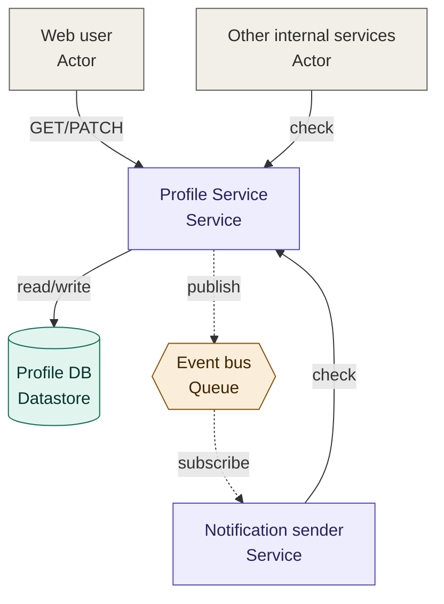
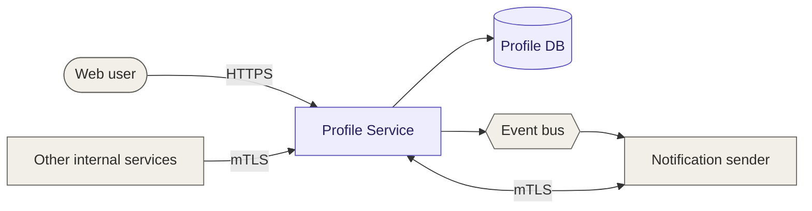

# Two Independent Approaches to the Same Dataflow Diagram

## Purpose

This document compares two genuinely separate methodologies for turning an RFC into a dataflow diagram (DFD) — not a baseline with patches applied, but two independently coherent approaches that happen to produce different results when pointed at the same document. Both diagrams below describe the same system: the Profile Service RFC's notification-preferences, sharing, and account-profile flows.

## Approach one: general-purpose diagramming

Claude's diagramming tool is not specific to RFCs, security reviews, or dataflow diagrams — it's a general capability for rendering any structural diagram from a description. Pointed at an RFC with no further guidance, it follows its own internal logic:

- **Read the system, infer a sensible flow.** Identify the actors, services, and stores the RFC describes, and lay them out however best avoids visual clutter — typically a hub-and-spoke shape around whichever node has the most connections.
- **Make edges self-explanatory.** An arrow between two nodes gets a short verb describing what's happening — "publish," "check," "read/write" — because an unlabeled arrow reads as incomplete in a general-purpose diagram.
- **Color by what a node fundamentally is.** An actor, a service, a datastore, and a queue are different *kinds* of thing, so each kind gets its own color — a natural categorization scheme for a diagram with no more specific context than "here is a system."
- **Show timing where it's visually cheap.** A dashed line for an asynchronous edge costs nothing and adds real information about how the system behaves.

This is a complete, defensible methodology on its own terms. It's the same one this diagramming tool would apply to a system described in a blog post, a whiteboard sketch, or a casual conversation — general-purpose because it has no reason to be anything else.

## Approach two: the `security-design-review-dataflow-diagram` skill

The skill is a separate methodology, built specifically around what a *security design review* needs from a diagram — which is a different job than "convey the general shape of a system." Its rules were arrived at independently, each grounded in what a reviewer actually needs to trust the diagram:

- **Extract before drawing.** Every node and edge comes from an explicit pass over the RFC's architecture, API, and security sections — not from a general impression of what a system "usually" looks like.
- **Never assert more than the source states.** An edge gets a protocol/mechanism label only when the RFC states it verbatim for that specific edge. No inference, no "this is probably HTTP," no filling in a plausible verb. Silence in the RFC becomes silence in the diagram — which is itself a finding, not a gap to paper over.
- **Separate "what is this" from "whose is this."** A reviewer needs both "what kind of component is this" (actor/service/datastore/queue) and "is this what the RFC is actually proposing, or something it merely touches" (in-scope/out-of-scope) — two independent questions. The skill spends *shape* on the first question and *color* on the second, so neither crowds out the other. General-purpose diagramming has no reason to make this split, because it isn't answering the second question at all.
- **Organize by architectural layer, not by traffic volume.** Client, service, and data tiers are laid into fixed columns regardless of which node happens to be busiest — because a security reviewer thinks in terms of trust boundaries between layers, not in terms of which node has the most arrows.
- **Say nothing twice.** A subtitle that restates what the shape already shows ("Datastore" under a cylinder) is space that could hold something the shape can't convey — what the component actually stores or does, per the RFC.

## Side by side

### General-purpose diagramming, applied to this RFC

### The skill's methodology, applied to the same RFC

## Where they diverge, and why each choice was made

| Question the diagram answers | General-purpose | Security-review skill |
|---|---|---|
| What kind of thing is each node? | Color (4 colors, one per type) | Shape (pill/rectangle/cylinder/hexagon) — freeing color for a different question |
| Is this what the RFC is proposing? | Not asked | Color (2 colors: in-scope/out-of-scope) — the question a reviewer actually needs answered first |
| What protocol runs on this edge? | Whatever seems plausible from context | Only what the RFC states verbatim for that edge; otherwise, nothing |
| Is this call sync or async? | Shown (dashed lines) | Not shown — judged not to be what a reviewer needs from *this* artifact |
| How are nodes arranged? | By connection density (hub-and-spoke) | By architectural layer (client/service/data columns) |
| What does a subtitle say? | The node's category | What the RFC actually says about that node |

## The underlying point

These aren't the same methodology with some options toggled differently — they're built to answer different questions. General-purpose diagramming optimizes for "make an unfamiliar system quickly legible to someone seeing it for the first time," and every choice serves that: inferred verbs, category colors, density-driven layout. The security-review skill optimizes for "let a reviewer trust exactly what's on the page and exactly what isn't," and every one of its choices serves that instead, often at the cost of the native diagram's legibility-by-inference. Two labeled edges disappearing into blank space (Profile Service's links to the database and the event bus) looks like a worse diagram by general-purpose standards. By security-review standards, it's the diagram correctly reporting that the RFC has a real gap there.
